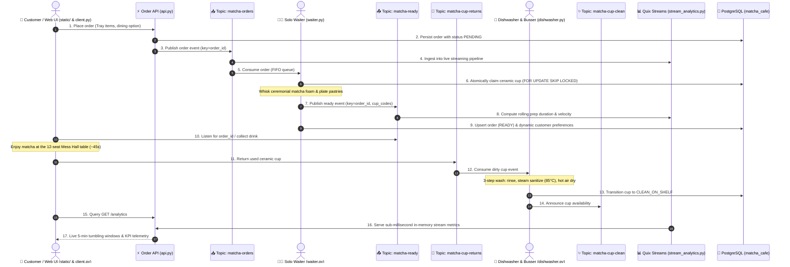
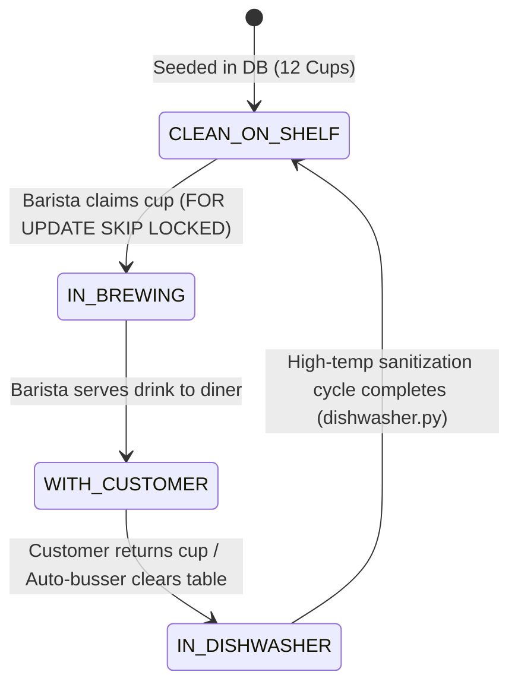

# 🍵 MatchaPubSub: Event-Driven Matcha Café & Streaming Engine

An asynchronous, event-driven microservices café platform powered by **Apache Kafka** (KRaft mode), **FastAPI**, **Quix Streams**, and **PostgreSQL 16**.

Simulates an artisanal Japanese matcha café featuring a solo barista, an automated dishwasher, a finite pool of handcrafted ceramic cups, real-time streaming analytics, and an interactive **Attack on Titan Survey Corps Mess Hall** web application with authentic multi-layer soundscapes.

---

## 🏛 Architecture & Data Flow

The platform decouples order ingestion, kitchen preparation, cup sanitation, and streaming telemetry through Kafka topics and PostgreSQL concurrency primitives:



---

## 🍵 Finite Ceramic Cup State Machine

To prevent plastic waste, the café operates with a finite pool of 12 numbered ceramic cups (`CUP-01` to `CUP-12`). Cup allocations and state transitions are strictly governed:



### Concurrency & Anti-Deadlock Protections
- **`FOR UPDATE SKIP LOCKED`**: Concurrent baristas and workers atomically claim clean cups without lock contention or double-allocation.
- **Automated Table Busser (`dishwasher.py`)**: Automatically collects abandoned cups from tables after an inactivity timeout (`CUP_BUSSER_TIMEOUT_SECONDS=30`) so cups never starve the queue.
- **Kitchen Expediter (`waiter.py`)**: If all cups are occupied and an order is waiting, the barista triggers an urgent expedited wash pass to break deadlocks.

---

## 📊 Real-Time Kafka Streaming Analytics (Quix Streams)

High-traffic dashboards running heavy PostgreSQL aggregation queries (`generate_series`, `GROUP BY`, `SUM`) suffer from table locks and query latency. 

**MatchaPubSub** integrates **Quix Streams (3.26)** in [`stream_analytics.py`](stream_analytics.py) to provide:
- **Tumbling 5-Minute Window Buckets**: Real-time timeseries aggregation over the past 60 minutes.
- **Live Popular Creations Leaderboard**: Running order volume and revenue per menu item.
- **Rolling Prep Velocity**: Tracks preparation durations between `matcha-orders` and `matcha-ready`.
- **In-Memory Materialization**: Zero database queries required for the live `/analytics` telemetry view, with seamless fallback to PostgreSQL when needed.

---

## 🏰 Attack on Titan Mess Hall Web Experience

The web application ([`static/index.html`](static/index.html)) provides a live, interactive visualization of the **Survey Corps Mess Hall**:
- **12-Seat Dining Table**: Authentic Attack on Titan characters (Eren, Mikasa, Armin, Levi, etc.) dynamically occupy seats.
- **Real-Time Soundscapes**: Layered authentic audio including ambient dining chatter, ceramic dishware clinking, steam hissing, and bamboo chasen whisking.
- **Seat-by-Seat Ordering**: Order custom beverages and pastries directly for any specific seat.
- **Scout Rush Simulator**: Dispatches multi-cadet rushes clamped strictly to available physical seats to prevent standing diners.
- **Live Cup Inventory Bar**: Visual shelf showing status distribution across clean, brewing, with customer, and dishwasher.

---

## 🚀 Quick Start Guide

### 1. Prerequisites
- [Docker Desktop](https://www.docker.com/) (running)
- Python 3.11+
- `kubectl` (optional, for Kubernetes deployments)

---

### 2. Start Kafka & PostgreSQL
Start Kafka in KRaft mode, Kafka UI, and PostgreSQL 16:
```bash
docker compose up -d
```

| Service | Port / URL | Description |
| :--- | :--- | :--- |
| **Kafka Broker** | `localhost:9092` | Apache Kafka 3.7 (KRaft mode, no Zookeeper) |
| **Kafka UI** | **[http://localhost:8080](http://localhost:8080)** | Cluster management, topic inspection & consumer groups |
| **PostgreSQL** | `localhost:5432` | Database (`matcha_cafe`, user: `barista`, password: `matchapassword`) |

---

### 3. Set Up Python Environment
```bash
python3 -m venv .venv
source .venv/bin/activate
pip install -r requirements.txt
```

---

### 4. Running the Café Microservices

For the full simulation experience, run the core services in separate terminal windows:

#### Terminal 1: Start the Order API & Web Server
```bash
source .venv/bin/activate
uvicorn api:app --host 0.0.0.0 --port 8000 --reload
```
> Open **[http://localhost:8000](http://localhost:8000)** in your browser to explore the Mess Hall web interface!

#### Terminal 2: Start the Solo Waiter (Barista)
```bash
source .venv/bin/activate
python3 waiter.py
```
*(Consumes tickets from `matcha-orders`, prepares drinks, claims cups, and announces completions on `matcha-ready`)*

#### Terminal 3: Start the Dishwasher & Auto-Busser
```bash
source .venv/bin/activate
python3 dishwasher.py
```
*(Listens to `matcha-cup-returns`, sanitizes dirty cups, and runs the background table busser)*

---

## 🎮 Customer Ordering & Simulations

### Order via Web Interface
Navigate to **[http://localhost:8000](http://localhost:8000)** to place orders with the visual menu tray or trigger the **"Simulate Scout Rush"** button.

### Order via CLI Client (`client.py`)
Run the interactive terminal prompt:
```bash
python3 client.py
```

Or place a direct, non-interactive order:
```bash
python3 client.py --name "Levi Ackerman" --drink "Hot Uji Matcha Latte" --milk "Oat Milk" --sweetness "0% (Unsweetened)"
```

### Morning Rush Simulator (`rush.py`)
Simulate a concurrent rush of customers entering the café simultaneously:
```bash
python3 rush.py --count 4
```

### Terminal Analytics Dashboard (`dashboard.py`)
Inspect the live PostgreSQL database state, customer loyalty rankings, and cup tracking in the terminal:
```bash
python3 dashboard.py
```

---

## 📂 Project Structure

| Path | Description |
| :--- | :--- |
| **`api.py`** | FastAPI service: REST endpoints, Kafka producer, static asset serving, and telemetry health probes |
| **`stream_analytics.py`** | Quix Streams real-time analytics engine (tumbling windows, rolling prep time, popular drinks) |
| **`waiter.py`** | Solo barista worker: consumes orders, manages cup claiming, whisks matcha, and notifies completions |
| **`dishwasher.py`** | Automated dishwasher daemon and background table busser for cup sanitization and return |
| **`client.py`** | Interactive and direct CLI customer client supporting HTTP API and direct Kafka fallback |
| **`rush.py`** | Concurrent multi-process customer generator for backpressure and queue testing |
| **`dashboard.py`** | Terminal dashboard displaying live database tables, revenue totals, and cup statuses |
| **`db.py`** | Database access layer: thread-safe connection pooling, atomic cup state machine, customer loyalty |
| **`init_db.sql`** | PostgreSQL schema definition (`products`, `orders`, `customers`, `cups`, `cup_audit_log`) |
| **`static/`** | Web application frontend: HTML5 UI, Attack on Titan character portraits, and multi-layer soundscapes |
| **`docker-compose.yml`** | Docker Compose definitions for Kafka (KRaft), Kafka UI, and PostgreSQL 16 |
| **`Dockerfile`** | Container image definition for café microservices |
| **`k8s/`** | Kubernetes manifests (`api-deployment.yaml`, `waiter-deployment.yaml`, `dishwasher-deployment.yaml`, etc.) |
| **`requirements.txt`** | Python dependencies (`confluent-kafka`, `fastapi`, `uvicorn`, `quixstreams`, `psycopg2-binary`, etc.) |

---

## ☸️ Kubernetes Deployment

All café microservices are containerized and orchestratable via Kubernetes:

```bash
# 1. Apply shared configuration
kubectl apply -f k8s/cafe-configmap.yaml

# 2. Deploy microservices
kubectl apply -f k8s/api-deployment.yaml
kubectl apply -f k8s/waiter-deployment.yaml
kubectl apply -f k8s/dishwasher-deployment.yaml

# 3. Simulate customer traffic via Kubernetes Jobs & CronJobs
kubectl apply -f k8s/customer-job.yaml       # Batch customer rush (Job)
kubectl apply -f k8s/customer-cronjob.yaml   # Periodic commuter arrivals (CronJob)
```

See [`k8s/README.md`](k8s/README.md) for detailed Kubernetes walkthroughs and scaling experiments.

---

## 🧠 Key Engineering Principles Demonstrated

1. **Decoupled Asynchronous Microservices**: The web frontend, barista worker, dishwasher, and streaming telemetry operate independently via Kafka topics (`matcha-orders`, `matcha-ready`, `matcha-cup-returns`, `matcha-cup-clean`).
2. **Key-Based Message Correlation**: Orders and ready announcements share identical `order_id` message keys, preventing partition mismatch and topic explosion.
3. **Finite Resource Lifecycle Management**: Reusable ceramic cups are modeled as a discrete state machine with PostgreSQL `FOR UPDATE SKIP LOCKED` concurrency and automated busser recovery.
4. **Hybrid Persistence & Streaming Architecture**: Combines ACID-compliant relational storage in PostgreSQL for transactional loyalty with stateful stream processing in Quix Streams for zero-latency operational metrics.
5. **Resilient Offset Commit Semantics**: Consumers commit Kafka offsets strictly after the corresponding physical preparation or sanitization step completes, guaranteeing at-least-once processing.
