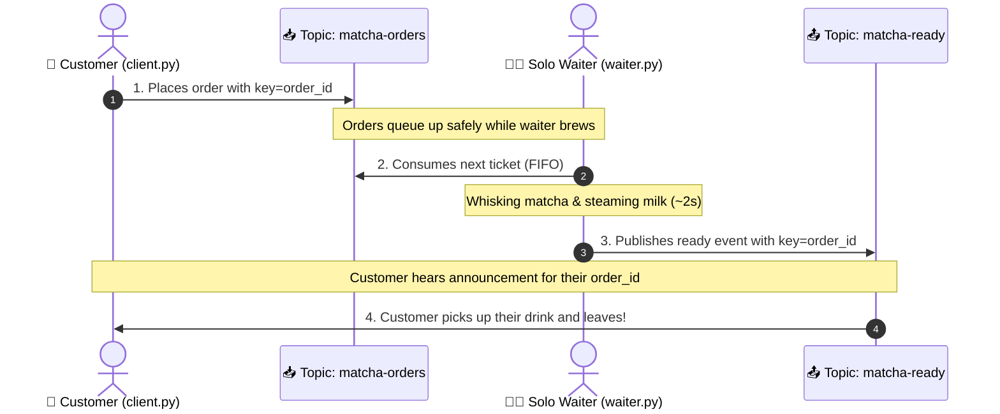

# 🍵 MatchaPubSub: Event-Driven Matcha Café

An asynchronous, event-driven café application powered by **Apache Kafka** (KRaft mode).

Simulates a real-world matcha café where multiple clients place orders, and a **single solo waiter (barista)** handles the queue one by one, calling out completed orders at a shared pickup counter.

---

## 🏛 Architecture: The "Pickup Counter" Pattern



### Why this design?
- **No Topic Explosion**: Avoids creating a topic per customer (a Kafka anti-pattern).
- **Key-Based Routing & Correlation**: Orders and ready announcements share the same `order_id` as the message key.
- **Backpressure & Decoupling**: If 10 customers arrive at once, Kafka safely buffers their orders. The solo waiter works at their own steady pace.

---

## 🚀 Quick Start Guide

### 1. Start Kafka & Kafka UI
Make sure Docker Desktop is running, then:
```bash
docker compose up -d
```
> View the cluster and live topics at **[http://localhost:8080](http://localhost:8080)**.

### 2. Activate Python Environment
```bash
source .venv/bin/activate
# If not yet installed: pip install -r requirements.txt
```

---

## 🎮 Running the Simulation

For the best experience, open two or three terminal windows side-by-side:

### Terminal 1: Start the Solo Waiter
```bash
python3 waiter.py
```
*(The waiter is ready at the counter, waiting for incoming tickets!)*

### Terminal 2: Order as a Customer
Run the interactive menu:
```bash
python3 client.py
```
Or place a direct order:
```bash
python3 client.py --name "Maya" --drink "Iced Ceremonial Matcha Latte" --milk "Oat Milk" --sweetness "25%"
```

### Terminal 3 (Optional): Simulate a Morning Rush Hour
Want to test the waiter under pressure? Spawn multiple customers simultaneously:
```bash
python3 rush.py --count 4
```
Watch the customers place orders at once, wait at the counter, and observe the solo waiter prepare each drink in sequence!

---

## 📂 Project Structure

| File | Description |
| :--- | :--- |
| **`docker-compose.yml`** | Kafka broker (KRaft mode) + Kafka UI dashboard |
| **`waiter.py`** | Solo barista worker: consumes orders, brews matcha, publishes ready notifications, commits offsets |
| **`client.py`** | Customer CLI: places order, listens to pickup counter, matches `order_id` key |
| **`rush.py`** | Concurrent multi-customer simulator to test queueing and backpressure |
| **`requirements.txt`** | Python dependencies (`confluent-kafka`) |

---

## 🧠 Key Kafka Concepts Demonstrated

1. **Consumer-Transform-Producer**: The waiter consumes from `matcha-orders`, transforms the state (brewing), and produces to `matcha-ready`.
2. **Manual Offset Commit**: The waiter only commits offsets *after* a drink is successfully prepared and announced, guaranteeing zero lost orders.
3. **Partition & Key Assignment**: Kafka distributes orders across partitions based on the hash of `order_id`.
4. **Broadcast & Client-Side Filtering**: All customers listen to the counter topic (`matcha-ready`), but each customer only reacts to the message matching their own `order_id`.
